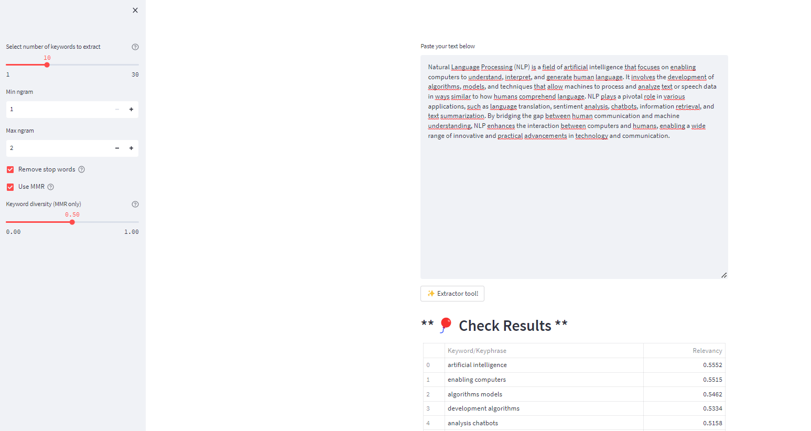

# AI Assistant with ChatGPT
This is a simple AI Assistant application that uses OpenAI's ChatGPT model to provide conversational responses. The application allows users to have interactive conversations with the AI assistant.

## Prerequisites

- Python 3.7 or higher
- OpenAI Python library
- Streamlit library
- Python-dotenv library


## Installation

1. Create a project repository:
```bash 
mkdir ai-assistant
```
2. Navigate to the project directory:
```bash 
cd ai-assistant
```
3. Create and activate a virtual environment (optional but recommended):
```bash
python3 -m venv venv source venv/bin/activate
```
4. Install the dependencies:
```bash
pip install -r requirements.txt
```
5. Create an OpenAI API key:

- Sign up for an account at [https://beta.openai.com/signup/](https://beta.openai.com/signup/) if you haven't already.
- Generate an API key from the OpenAI dashboard.

6. Set up the environment variables:

- Replace `YOUR_API_KEY` in the `.env` file with your actual OpenAI API key.


## Directory Structure 

The directory structure of this project looks like this:

```
├── README.md          <- The top-level README for developers using this project.
│
├── utils.py           <- Script to store function that will be used to create the Chatbot.
│
│
├── .env               <- File that stores your API_KEY. 
│
│
├── Outputs            <- Generated analysis as PNG.
│   └── figures        <- Generated figures to be used in README file
│
├── requirements.txt   <- The requirements file for reproducing the analysis environment, e.g.
│                         generated with `pip freeze > requirements.txt`
│
├── Chatbot.py         <- Main program that create the Chatbot application.
│ 
```


## Usage

1. Start the application:
```bash
streamlit run Chatbot.py
```
2. Access the app in your browser at [http://localhost:8501](http://localhost:8501).

3. You will see a text input field where you can enter your messages. Type a message and press Enter to have a conversation with the AI assistant.

4. The chat history will be displayed in the app, showing both user and assistant messages.

5. To exit the app, press `Ctrl+C` in the terminal.

## Screenshots




